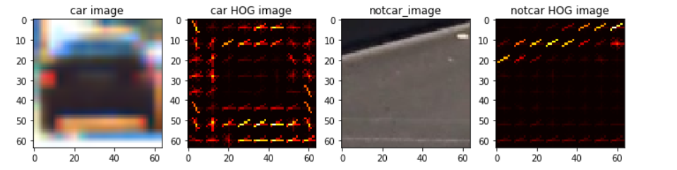
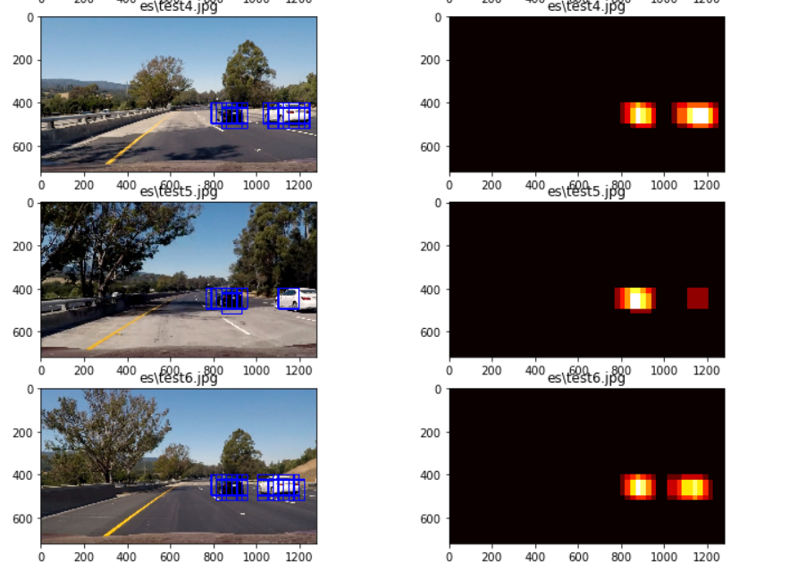

# Vehicle Detection

The Project
---

The goals / steps of this project are the following:

* Perform a Histogram of Oriented Gradients (HOG) feature extraction on a labeled training set of images and train a classifier Linear SVM classifier
* Optionally, you can also apply a color transform and append binned color features, as well as histograms of color, to your HOG feature vector. 
* Note: for those first two steps don't forget to normalize your features and randomize a selection for training and testing.
* Implement a sliding-window technique and use your trained classifier to search for vehicles in images.
* Run your pipeline on a video stream (start with the test_video.mp4 and later implement on full project_video.mp4) and create a heat map of recurring detections frame by frame to reject outliers and follow detected vehicles.
* Estimate a bounding box for vehicles detected.

Overview 
---
This is a summary of the approach used to detect vehicles on an image:

* Extract features from the vehicle
	- Color Features
	- Gradient Features 
	- Spatial Features
* Use a labeled data set of cars/not cars to train a car/not car classifier
    - SVM (Support Vector Machines) is the model retained for the classifier
    - Classifier is trained to an accuracy of 99.32%
* Use a sliding window approach to traverse the whole image and apply the classifier to each window to detect a potential car
* A window match is an indicator of a very high chance of car detection (some false positive will be detected as well)

This is a summary of the approach used to detect vehicles on an video, the steps below are applied for each frame:

* Process the frame with the previous image pipeline described above
* Keep a record of 10 previous frame
* Generate a structure that sums all the 10 previous frame heatmaps values
* Threshold the summed heatmaps structure to get rid of false positive 

Steps
---

##Extracting Features (HOG, Colors and Spatial Features)

The most interesting part here is the HOG feature let's look at how it looks like on a car/ not car example:

The parameters retained for HOG features extractions are

orients = 9
pix_per_cell = 8 # HOG pixels per cell
cell_per_block = 2 # HOG cells per block
hog_channel = 'ALL' # Can be 0, 1, 2, or "ALL"

`extract_features()` takes care of this part it produces a feature vector that is a concatenation of HOG features, color histogram features and spatial binning features.

## Choosing and Training a Car/Not Car Classifier

The natural choice for a classifier was an SVM as it was explained in the lesson and gave decent results when I tried it.

The SVM was trained with the Car/Not Car data sets provided in this project.

After extracting the features a scaler was applied to data:
    
    X = np.vstack((car_features, notcar_features)).astype(np.float64)                   
    X_scaler = StandardScaler().fit(X)
    scaled_X = X_scaler.transform(X)

Then, it was straightforward to train the classifier by feeding it the labeled and scaled feature data:

    svc = LinearSVC()
    svc.fit(X_train, y_train)

The training gave an accuracy 99.32% of on the testing set (90% was used for training, 10% for testing) 

## Sliding Window Search

`find_cars(img, scale)` is where the sliding window search happens, it uses a nice trick to scale the image instead of the window so that only one hog feature extraction is needed per image

I would like to thank Ryan Keenan for providing that code in the project Q&A session

[link to Ryan Keenan's Q&A](https://www.youtube.com/watch?v=P2zwrTM8ueA&list=PLAwxTw4SYaPkz3HerxrHlu1Seq8ZA7-5P&index=5&t=4154s)

Cells per step were used instead of overlap and cell per step of 2 gave good results

Manually trying few scales from 1 to 2, I retained a scale of 1.5 as it gave decent results.

## Exploring some results

This is the output of the pipeline on some few examples:

On the left you can see the cars being detected and on the right the corresponding heatmaps.

The heatmaps will turn out to be very useful in the following step (the video) as they will allow us to filter out false positives.

## Video Implementation

This is a link to the video :

[link to output video](https://drive.google.com/open?id=1W0MevlZq6iXaHkBHUjYBWVCPv0JHDHeP)

The following pipeline has been used to process the video and filter out false positives:

For every frame in video:

* Process the current frame with the image processing pipeline
* Keep a record of 10 previous frame heatmaps in memory 
* Sums all the 10 previous frame heatmaps values and threshold result to get rid of false positive 

For this a very simple class was created 

    class Frames:
        def __init__(self):
            self.heat_map_q = deque(maxlen=10)
    
        # updates the internal values
        def update(self, heat_map):
            self.heat_map_q.append(heat_map)
            return
    
        def sum_and_threshold(self, threshold):
            heat_map = np.sum(self.heat_map_q, axis=0)
            heat_map[heat_map <= threshold] = 0
            return heat_map

The class is simple 10 frame heatmap cache that is thresholded to get rid of false positives

## Conclusion

This project was very rewarding and interesting as it shows how traditional computer vision techniques can produce a decent pipeline (no neural nets were used).

The SVN accuracy of 99% was great and gave very few false positives especially when coupled with the heatmap thresholding technique.

The pipeline may likely fail if the conditions of images changes (such as light condition) also in highways with big number of lanes as the vehicles on the farthest lanes may look warped.

The result could be improved a lot by generating a bigger data set of car / not car images. This could be done by:
* collecting more images at different light conditions
* artificially augmenting the data set by performing geometric transformations as well as color/light transformation to generate more data and use it to retrain the SVM
* Other classifier could be used (Maybe a Deep Neural Net)
 

